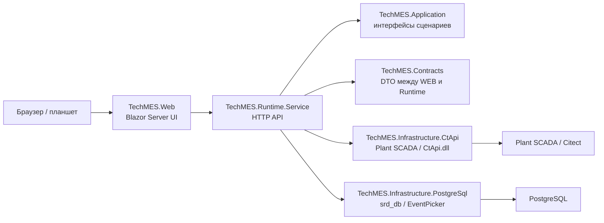

# TechMES WEB: архитектура и связи модулей

Этот документ описывает текущую WEB-реализацию TechMES и связи между слоями.  
Он дополняет комментарии в коде: в коде оставляем точечные комментарии у классов, контрактов и сложной логики, а общую картину держим здесь.

## Общая схема



## Проекты

`TechMES.Contracts`  
Общие DTO и enum, которыми обмениваются WEB и Runtime.Service. Здесь не должно быть логики доступа к БД, CtApi или UI.

### Contracts и Application

`TechMES.Application` задает интерфейсы сценариев: `IEquipmentCatalogProvider`, `IEquipmentInfoStore`, `IEquipmentParamProvider`, `IMessageStore`, `IEventLogStore`, `IEquipmentSoeProvider`, `IPlantScadaGateway`. Runtime.Service работает с этими интерфейсами, поэтому конкретную реализацию можно заменить через DI.

`TechMES.Contracts` содержит только DTO/enum для HTTP и SignalR:

| Папка | Назначение |
| --- | --- |
| `Equipment` | Узлы дерева оборудования, станции, типы и Info-счетчики |
| `Info` | Карточка оборудования, файлы, заметки, избранное и PDF view state |
| `Param` | Snapshot, trend, reference pages и write request/response |
| `Messages` | Сообщения, запросы сохранения и SignalR notifications |
| `EventLog` | Operation actions и Alarm history |
| `SOE` | SOE-события и ответ SOE endpoint-а |
| `Scada` / `Runtime` | Диагностика Runtime.Service и Plant SCADA adapter-а |

`TechMES.Application`  
Интерфейсы сценариев: каталог оборудования, Param, Info, Messages, EventLog, SOE. Runtime.Service зависит от этих интерфейсов, а конкретная инфраструктура подставляется через DI.

`TechMES.Infrastructure.CtApi`  
Работа с Plant SCADA/Citect: чтение оборудования, tags, trend tags, EquipRefBrowse, TagRead/TagWrite, Cicode audit.

### CtApi-инфраструктура

Слой `TechMES.Infrastructure.CtApi` делит работу с SCADA на несколько уровней:

| Класс | Роль |
| --- | --- |
| `CtApiNativeClient` | Единственное место, где WEB-решение напрямую пользуется legacy wrapper-ом `CtApi.CtApi` и native `CtApi.dll` |
| `CtApiPlantScadaGateway` | Безопасный gateway для health, TagRead и TagWrite; сериализует вызовы CtApi и запрещает write, если `CtApi:AllowWrites = false` |
| `CtApiEquipmentCatalogProvider` | WPF-совместимая загрузка каталога через таблицу `Tag`, `*_HASHCODE`, `*_EQUIP`, `EquipGetProperty` и `EquipRefBrowse` |
| `CtApiEquipmentParamProvider` | Param snapshot, trend, reference pages и write-flow с allow-list и Cicode audit |
| `CtApiEquipmentSoeProvider` | SOE: читает trend-слово `STW/STW01`, определяет изменившийся bit code и переводит его в текст события |
| `MockPlantScadaGateway` / `DisabledPlantScadaGateway` | Режимы разработки и отключенной SCADA, чтобы Runtime.Service мог стартовать без реального CtApi |

Папка `Legacy` содержит перенесенный CtApi wrapper из WPF/документации Citect. Его лучше менять минимально: основной русский контекст и связи описаны в адаптерах выше, а legacy-код остается тонкой прослойкой к vendor API.

`TechMES.Infrastructure.PostgreSql`  
Работа с существующими таблицами PostgreSQL. Здесь живут Info, Messages, favorites, notes, PDF view state, Operation actions и Alarm history.

### PostgreSQL-хранилища

Слой `TechMES.Infrastructure.PostgreSql` не содержит UI-логики. Он реализует application-интерфейсы и изолирует Runtime.Service от конкретных таблиц:

| Store | Интерфейс | Основные таблицы |
| --- | --- | --- |
| `PostgreSqlEquipmentInfoStore` | `IEquipmentInfoStore` | `equip_info`, `equip_note`, `equip_info_photo`, `equip_info_instruction`, `equip_info_scheme`, `equip_photo`, `equip_instruction`, `equip_scheme`, `equip_info_pdf_view`, `equip_favorite` |
| `PostgreSqlMessageStore` | `IMessageStore` | `equip_message`, `equip_message_view`, trigger `techmes_set_equip_message_updated_at` |
| `PostgreSqlEventLogStore` | `IEventLogStore` | `OperatorAct`, `alarm_history` |

Info store читает карточку оборудования отдельно от бинарных файлов: сначала загружаются поля карточки, счетчики и метаданные вложений, а фото/PDF/схемы подгружаются отдельным запросом только когда браузер реально открывает файл. Это повторяет идею кеширования из WPF и не перегружает Runtime.Service большими blob-данными при обычном выборе оборудования.

`TechMES.Runtime.Service`  
Backend HTTP API. Он собирает зависимости, читает настройки, открывает endpoints и скрывает от WEB детали CtApi/PostgreSQL.

`TechMES.Web`  
Blazor Server интерфейс. WEB не обращается к CtApi и БД напрямую; он вызывает Runtime.Service через typed API clients.

## Equipment / Info

WEB загружает каталог оборудования через `EquipmentApiClient`, Runtime берет данные из `IEquipmentCatalogProvider`.  
Выбранное оборудование хранится в `SelectedEquipmentState`, чтобы Info/Param/QR могли работать с одним текущим item.

Info-модуль показывает карточку оборудования, описание, фото, PDF, схемы, notes и QR.  
Файлы отдаются через Runtime.Service и проксируются WEB-слоем, чтобы браузер получал корректные URL, cache headers и range requests для PDF.

## Runtime endpoints

Все endpoints Runtime.Service подключаются через `MapRuntimeEndpoints`.

| Endpoint group | Назначение |
| --- | --- |
| `/api/health` | Диагностика Runtime.Service, версии, устройства и message storage |
| `/api/equipment` | Каталог оборудования, favorite-флаги и Info-счетчики |
| `/api/info` | Карточка оборудования, файлы, PDF view state, notes, description |
| `/api/param` | Snapshot, trend, reference pages и Param write |
| `/api/messages` + `/hubs/messages` | Сообщения и SignalR live-уведомления |
| `/api/event-log` | Operation actions и Alarm history из EventPicker/PostgreSQL |
| `/api/soe` | SOE-события выбранного оборудования |
| `/api/scada` | Низкоуровневая диагностика Plant SCADA adapter-а |

## Web clients и state

`TechMES.Web/Clients` содержит typed HTTP clients.  
Компоненты Blazor не собирают URL руками, а вызывают методы клиентов:

| Client | Зона ответственности |
| --- | --- |
| `EquipmentApiClient` | Каталог оборудования, выбранный item, favorite |
| `InfoApiClient` | Info snapshot, файлы, description, notes, PDF view state |
| `ParamApiClient` | Param snapshot, trend, refs и write |
| `MessageApiClient` | Messages REST API |
| `EventLogApiClient` | Operation actions и Alarm history |
| `SoeApiClient` | SOE для выбранного оборудования |
| `RuntimeStatusApiClient` | `/api/health` для диагностики Runtime.Service |

`TechMES.Web/State` содержит scoped-состояние Blazor Server circuit:

| State | Назначение |
| --- | --- |
| `SelectedEquipmentState` | Текущее выбранное оборудование для страниц Info/Param/QR |
| `EquipmentFooterState` | Footer-счетчики дерева и Info-модуля |
| `QrScannerState` | Событие QR-сканирования от MainLayout к активной странице |

Scoped-сервисы важны: у каждого браузера/планшета свой Blazor circuit, поэтому выбор оборудования одного клиента не меняет выбор другого клиента.

## Web UI и JS interop

Основной экран живет в `TechMES.Web/Components/Pages/Equipment.razor`. Он отвечает за фильтры, дерево оборудования, поиск, QR-переход к оборудованию и переключение правой зоны между Info и Param.

Правые панели вынесены в отдельные компоненты:

| Компонент | Назначение |
| --- | --- |
| `EquipmentInfoPanel.razor` | Info-карточка, description, images carousel, PDF/schemes, notes и QR-код выбранного оборудования |
| `EquipmentParamPanel.razor` | Param snapshot, trend, reference pages, write editor и polling только при активной Param-зоне |
| `EquipmentTrendChart.razor` | Blazor-wrapper над Apache ECharts; передает компактный DTO в JavaScript |
| `QrScannerDialog.razor` | Модальное окно камеры, выбор camera device, browser diagnostics и server-side ZXing fallback |
| `Param*RefView.razor` | Read-only reference pages PLC, DI/DO, DryRun и ATV |

JS interop находится в `TechMES.Web/wwwroot`:

| Файл | Назначение |
| --- | --- |
| `techmesParamTrendChart.js` | Apache ECharts, mouse/touch pan/zoom, axisPointer, tooltip и lazy-запрос истории у Blazor |
| `techmesQrScanner.js` | Camera preview, BarcodeDetector, fallback отправки grayscale кадра в Blazor/ZXing |
| `techmesPdfViewer.js` | Попытка прочитать page/zoom из browser PDF viewer fragment |

Внешние/minified файлы, например `wwwroot/lib/echarts/echarts.min.js`, не комментируются и не правятся вручную. Это vendor-артефакты, их лучше обновлять целиком через пакет/дистрибутив библиотеки.

## Param read-only

Param-модуль состоит из:

- snapshot: текущие значения Param items;
- trend: график Apache ECharts;
- reference pages: PLC, DI/DO, DryRun, ATV;
- alarm/time/value таблицы.

`EquipmentParamPanel.razor` управляет видимой вкладкой и polling.  
Если пользователь ушел из Param или вкладка Graph не видна, лишние trend-запросы прекращаются, чтобы не грузить CtApi.

## Param write

Write-flow сейчас такой:

1. WEB показывает кнопку записи только для `ParamItemDto.CanWrite`.
2. Оператор открывает editor, вводит значение и комментарий.
3. WEB показывает confirm dialog.
4. Runtime.Service получает `ParamWriteRequest`.
5. Backend повторно проверяет:
   - оборудование найдено;
   - это не group node;
   - item существует у типа оборудования;
   - item есть в allow-list `ParamWriteDefinitions`;
   - комментарий есть, если включен `RequireComment`;
   - значение можно нормализовать под boolean/number;
   - tag можно разрешить через CtApi.
6. Backend читает текущее значение перед записью.
7. Если включен `DryRun`, TagWrite не выполняется.
8. Для реальной записи должны быть включены оба флага:
   - `ParamWrites.Enabled = true`;
   - `CtApi.AllowWrites = true`;
   - `ParamWrites.DryRun = false`.
9. После успешного `TagWrite` выполняется audit через Cicode:
   - `TagWrite("sWndTitle", "...")`;
   - `SaveActionOperators(...)`.

Audit не создает новых WEB-таблиц. Данные пишет сама SCADA-логика, как это было в WPF-проекте.

## Operation actions / Alarm history / SOE

Operation actions и Alarm history читаются из существующей EventPicker/PostgreSQL базы.  
SOE читается через CtApi/trend-события. Эти модули добавлены отдельными пунктами меню и не смешиваются с Param write.

## Настройки

Основные runtime-настройки находятся в `TechMES.Runtime.Service/appsettings.json`.

Важные флаги для записи:

```json
"CtApi": {
  "AllowWrites": false
},
"ParamWrites": {
  "Enabled": true,
  "DryRun": false,
  "RequireComment": true,
  "AuditEnabled": true
}
```

Windows-пользователей для прав доступа планируется добавить отдельным этапом.  
SCADA privilege/UserInfo/GetPriv в текущем WEB write-flow не используется.
